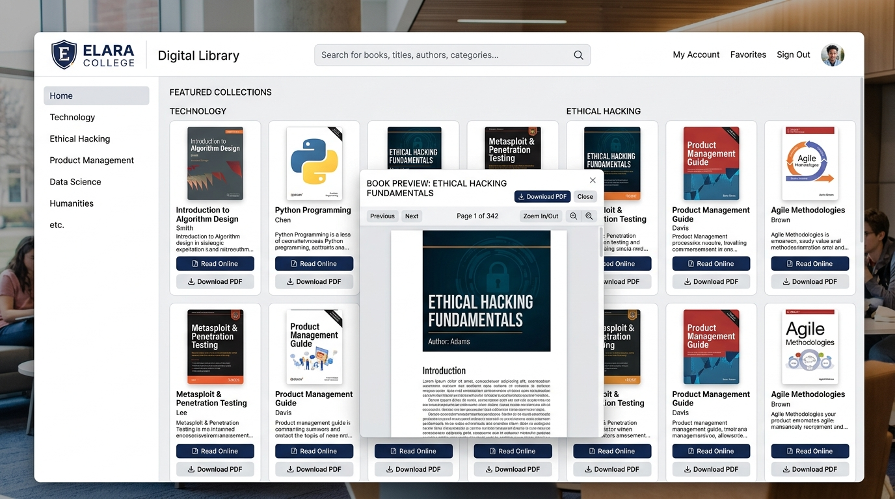
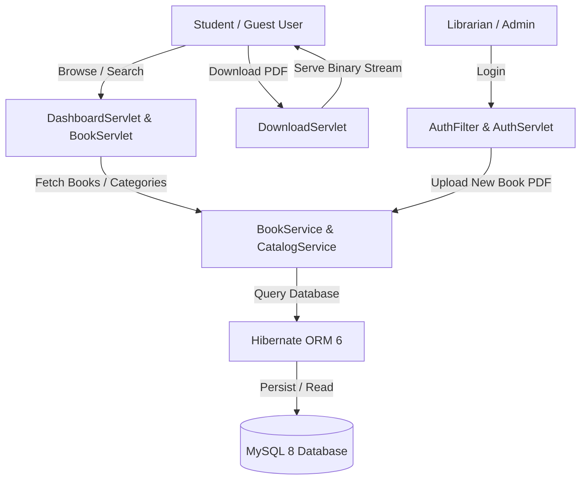

# Smart Digital Library — Open Access Management System

       

A **free, open digital library platform** for college students. Browse and download PDF books by domain — with zero friction, zero signups for students, and instant access.



**Admin / Librarians** upload and manage digital resources. **Students** visit, search, and download PDFs.

Built with **Java Jakarta Servlets 6 + Thymeleaf 3.1 + Hibernate 6 + MySQL 8**.

---

## Architecture & System Workflow



---

## Tech Stack

| Layer | Technology |
|-------|------------|
| **Backend** | Java 17+, Jakarta Servlet 6, Hibernate ORM 6, HikariCP |
| **View Engine** | Thymeleaf 3.1, Bootstrap 5, FontAwesome |
| **Authentication** | BCrypt Password Hashing, Session Management, Security Filters |
| **Testing** | JUnit 5, Mockito, H2 Database (In-Memory) |
| **Containers & Deployment** | Docker, Docker Compose, Tomcat 10.1, Vercel (`vercel.json`) |

---

## Domains & Categories

- **Technology** (Java, Spring Boot, React, Node.js, AI/ML)
- **Ethical Hacking & Cyber Security**
- **Product Management & Business**
- **Personal Development & Leadership**
- **Academic Textbooks & Course Material**

---

## Setup & Deployment

### Option 1: Vercel Deployment (Static Web Assets)

DigitalLibrarySystem includes a custom `vercel.json` for asset hosting on Vercel:

1. Import the repository into [Vercel Dashboard](https://vercel.com/new).
2. Set Root Directory to `DigitalLibrarySystem`.
3. Deploy!

### Option 2: Docker Compose (Full Stack Tomcat 10 + MySQL 8)

Start MySQL database and Tomcat container with 1 command:

```bash
docker compose up --build -d
```
Access the application at `http://localhost:8080/`.

### Option 3: Local Manual Setup

#### Prerequisites
- Java 17+
- Maven 3.8+
- MySQL 8+
- Apache Tomcat 10+ (Jakarta EE 10)

#### 1. Database Setup
```sql
CREATE DATABASE digital_library;
```

#### 2. Configure Hibernate (`src/main/resources/hibernate.cfg.xml`)
`HibernateUtil` automatically detects environment variables (`JDBC_URL`, `DB_HOST`, `DB_PORT`, `DB_USER`, `DB_PASS`). Update `hibernate.cfg.xml` for local manual overrides.

#### 3. Build & Run Tests
```bash
mvn clean test package
```

Deploy `target/digital-library.war` to Apache Tomcat 10 `webapps/`.

---

## Admin Credentials

| Role | Username | Default Password |
|------|----------|------------------|
| Admin | `admin` | `admin123` |
| Librarian | `librarian` | `lib123` |

*Note: Students do not register or login — access to reading and downloading materials is completely open.*

---

## Testing

Run unit tests locally:

```bash
mvn test
```

Test coverage includes:
- `DigitalLibraryTest`: Entity validation, role authorization, DTO constraints, and Hibernate mappings.
- `PasswordUtilTest`: BCrypt password hashing, salt generation, and verification.

---

## License

Educational / Portfolio project under MIT License.
